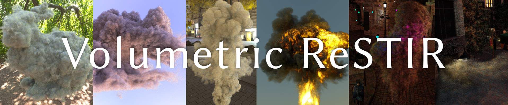
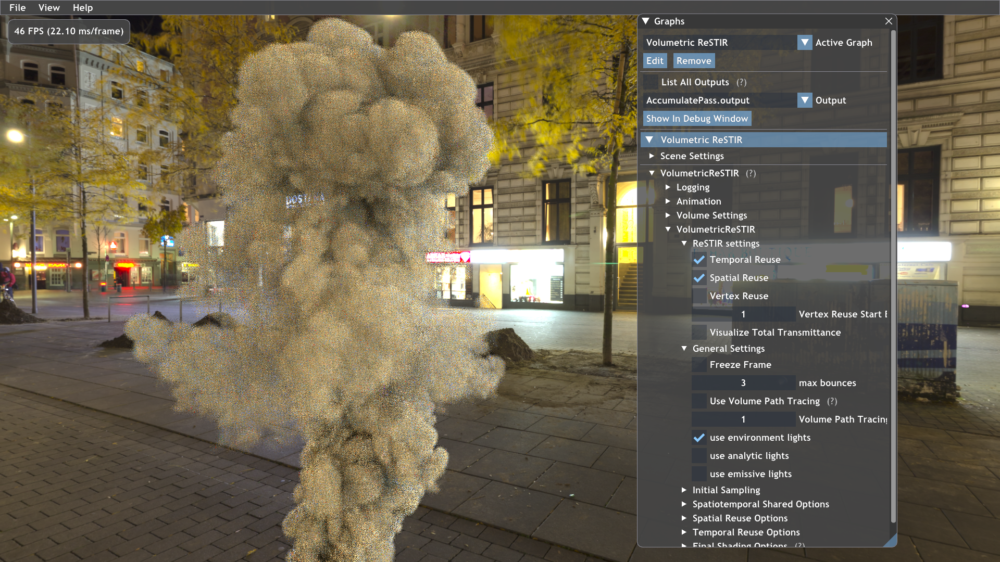

# Fast Volume Rendering with Spatiotemporal Reservoir Resampling (Volumetric ReSTIR) 

## Introduction
- This repo includes the source code for the SIGGRAPH Asia 2021 paper Fast Volume Rendering with Spatiotemporal Reservoir Resampling \[Lin et al. 2021\]. The project page of the paper can be found at <https://dqlin.xyz/pubs/2021-sa-VOR/>.
- The method is implemented as a render pass called "VolumetricReSTIR" (Source\RenderPasses\VolumetricReSTIR) in Falcor 4.2.
There are also modifications in the original Falcor 4.2 code to support GVDB volumes. See README_Falcor.md for the original 
README file provided by Falcor.
- Some example scripts are provided to show how the method works in different scenes. "RunDemo.bat" contains a list of these scripts.
- Before running the scripts, you need to compile the program and **download the scene files** following the instruction below.

## Prerequisites
- Windows 10 version 1809 or newer
- Visual Studio 2019
- Microsoft Windows SDK version 1903 (10.0.18362.1) Or Newer (https://developer.microsoft.com/en-us/windows/downloads/sdk-archive)
- RTX 2060 or Higher

## Performance notice
To reproduce the performance in the paper:
- Use RTX 3090 and GeForce Game Ready Driver Version 471.68
- Driver versions newer than 471.68 can cause significant slow down of our method with large VDB models (like the bunny cloud).

## How to compile
- Open Falcor.sln and Build Solution in configuration ReleaseD3D12

## Fetch example scenes
- Download the example scenes (7.87 GB) [here](https://drive.google.com/file/d/1oo29EuEN4TputF6JGTJYze_e08uDRbpx/view?usp=sharing)
and extract the zip file inside `Bin\x64\Release\Data`
- You can also extract the zip file inside `Source\RenderPasses\VolumetricReSTIR\Data`. In this way, every time the project VolumetricReSTIR is built, the content will be pasted into the 
binary folder of your build configuration

## Run the demo
- execute RunDemo.bat (you can edit the script to select what you want to run)
- an example screenshot

## Prepare GVDB asset (.vbx files)
- run `GVDBConverter\gImportVDB.exe [Your VDB file].vdb [Number of Mip Levels]`
- Example: `GVDBConverter\gImportVDB.exe volumetric_bunny.vdb 4`
- The converter will generate .vbx files for each mip map level and corresponding conservative grids (zero-density voxels are replaced by the average density of their neighbors).
If the original VDB file contains temperature or velocity grids, they will also be converted into separate .vbx files.
- To compile the gImportVDB.exe, go to gvdb-voxel-src folder and use CMake. The source code is modified from https://github.com/NVIDIA/gvdb-voxels

## To enable Optix denoiser
- The denoiser requires CUDA (tested against 10.1/10.2, but higher versions should also be supported) and Optix 7.3. Make sure that you have those two SDKs in your computer if you want to use the Optix denoiser.
- Go to "Source\Externals\.packman" and run `mklink /J cuda [Your CUDA sdk installation directory]` and `mklink /J optix [Your Optix sdk installation directory]` to create junctions named "cuda" and "optix" 
- Example: `mklink /J cuda "C:\Program Files\NVIDIA GPU Computing Toolkit\CUDA\v10.1"` and `mklink /J optix "C:\ProgramData\NVIDIA Corporation\OptiX SDK 7.3.0\include"`
- `Source\RenderPasses\VolumetricReSTIR\Scripts\run_plume_denoiser.py` is an example script showing how to use optix denoiser on top of our render pass 
